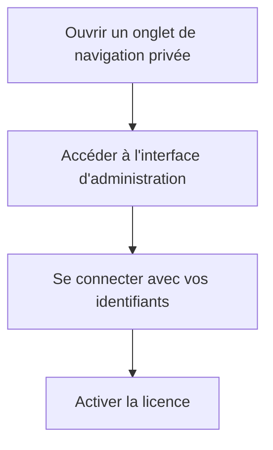

# 📦 ClientXCMS — Guide d'Installation Docker

> [!NOTE]
> **Version 1.0** — Ce guide officiel intègre les correctifs communautaires pour les erreurs courantes **1045 Access Denied** (MariaDB) et **419 Page Expired** (session Laravel en HTTP). Suivez les étapes dans l'ordre pour éviter ces problèmes.

---

## 🏷️ Informations & Technologies
* **Système cible :** Debian 12+
* **Stack :** Docker Compose, MariaDB, Laravel
* **Protocoles :** HTTP & HTTPS

---

## 🗺️ Sommaire
1. [00. Prérequis](#00-prérequis)
2. [01. Préparation du Système](#01-préparation-du-système)
3. [02. Récupération du Projet](#02-récupération-du-projet)
4. [03. Configuration du fichier `.env`](#03-configuration-du-fichier-env)
5. [04. Lancement et Patch de Session](#04-lancement-et-patch-de-session)
6. [05. Initialisation de ClientXCMS](#05-initialisation-de-clientxcms)
7. [06. Premier Accès et Activation de la Licence](#06-premier-accès-et-activation-de-la-licence)
8. [🔄 Outil : Script `maj_env.sh`](#-outil--script-maj_envsh)
9. [🛠️ Guide de Dépannage (Troubleshooting)](#%EF%B8%8F-guide-de-dépannage-troubleshooting)
10. [✅ Checklist de Vérification](#-checklist-de-vérification)

---

## 00. Prérequis

Avant de commencer, vérifiez que votre environnement remplit ces conditions :
* Un serveur Linux propre (Debian 12+ recommandé).
* Un accès `sudo` ou `root` sur la machine.
* Les ports `80` et `443` libres et accessibles.
* Une connexion Internet active pour télécharger les images Docker.

---

## 01. Préparation du Système

Mettez à jour les paquets du système et installez les outils requis :

```bash
sudo apt update && sudo apt upgrade -y
sudo apt install git nano curl -y
```

Installez ensuite Docker et Docker Compose via le script officiel :

```bash
sudo curl -fsSL https://get.docker.com -o get-docker.sh
sudo sh get-docker.sh
```

> [!TIP]
> Vérifiez l'installation avec `docker --version` et `docker compose version`. Les deux commandes doivent retourner un numéro de version valide.

---

## 02. Récupération du Projet

Créez le dossier de travail, clonez le dépôt et préparez les fichiers de configuration :

```bash
sudo mkdir -p /var/www
cd /var/www
sudo git clone https://github.com/ClientXCMS/clientxcms.git
cd clientxcms

# Création des fichiers à partir des exemples
sudo cp docker-compose.example.yml docker-compose.yml
sudo cp .env.example .env
```

---

## 03. Configuration du fichier `.env`

Ouvrez le fichier `.env` avec Nano :

```bash
nano .env
```

Configurez scrupuleusement les trois sections suivantes :

### 1 — URL de l'application

| Cas d'usage | Valeur à saisir |
| :--- | :--- |
| **IP locale / test HTTP** | `APP_URL=http://192.168.X.X` |
| **Production / HTTPS** | `APP_URL=https://votre-domaine.com` |

### 2 — Base de données

> [!WARNING]
> Le `docker-compose.yml` communautaire fixe les identifiants de la base de données sur `clientxcms`. Ne modifiez **aucune** de ces valeurs sous peine d'obtenir une erreur **1045 Access Denied**.

```env
DB_CONNECTION=mysql
DB_HOST=database
DB_PORT=3306
DB_DATABASE=clientxcms
DB_USERNAME=clientxcms
DB_PASSWORD=clientxcms
```

### 3 — Correctif Anti-Erreur 419 (HTTP uniquement)
*Si vous effectuez des tests sans certificat HTTPS, ces paramètres débloquent les formulaires de connexion :*

```env
SESSION_DRIVER=cookie
SESSION_SECURE_COOKIE=false
SESSION_SECURE=false
```

> [!TIP]
> Pour sauvegarder et quitter Nano : faites `Ctrl+X`, puis tapez `Y` (ou `O` en français), puis appuyez sur `Entrée`.

---

## 04. Lancement et Patch de Session

Démarrez les conteneurs en arrière-plan :

```bash
sudo docker compose --env-file .env up -d
```

### Patch HTTP (si vous testez sans HTTPS)
L'image Docker force parfois la sécurité des cookies en interne. Injectez votre `.env` directement dans le conteneur pour écraser ce comportement :

```bash
sudo docker compose exec -i app sh -c "cat > .env" < .env
```

> [!NOTE]
> Pour vérifier l'état des conteneurs : `sudo docker compose ps`. Tous les services doivent afficher le statut **running** (et non *restarting*).

---

## 05. Initialisation de ClientXCMS

Exécutez ces trois commandes dans l'ordre :

1. **Générer la clé de chiffrement de l'application :**
   ```bash
   sudo docker compose exec app php artisan key:generate
   ```

2. **Vider et optimiser tous les caches Laravel :**
   ```bash
   sudo docker compose exec app php artisan optimize:clear
   ```

3. **Créer le compte administrateur (suivez les instructions à l'écran) :**
   ```bash
   sudo docker compose exec app php artisan clientxcms:install-admin
   ```

> [!TIP]
> La dernière commande vous demandera de saisir un nom d'utilisateur, une adresse email et un mot de passe. Conservez précieusement ces identifiants !

---

## 06. Premier Accès et Activation de la Licence



1. **Ouvrir un onglet de navigation privée :** Indispensable pour éviter les anciens cookies persistants qui pourraient bloquer la connexion.
2. **Accéder à l'interface d'administration :** Rendez-vous sur l'adresse configurée dans votre `APP_URL`, par exemple :  
   `http://192.168.50.138/admin/login`
3. **Se connecter :** Utilisez l'email et le mot de passe créés lors de la commande `install-admin`.
4. **Activer la licence :** Sur l'écran de licence, cliquez sur le bouton vert. Si vous êtes sur une IP locale, autorisez temporairement cette IP dans votre espace client sur le site officiel de ClientXCMS.

---

## 🔄 Outil : Script `maj_env.sh`

Par défaut, Docker et Laravel n'appliquent pas les modifications du `.env` à chaud. Ce script automatise la resynchronisation complète.

Créez le fichier :
```bash
nano maj_env.sh
```

Collez-y le contenu suivant :
```bash
#!/bin/bash
echo "🔄 Application des modifications du .env..."
sudo docker compose down
sudo docker compose --env-file .env up -d --force-recreate
echo "🧹 Injection et nettoyage du cache..."
sudo docker compose exec -i app sh -c "cat > .env" < .env
sudo docker compose exec app php artisan optimize:clear
echo "✅ Configuration synchronisée avec succès !"
```

Rendez le script exécutable :
```bash
chmod +x maj_env.sh
```

> [!TIP]
> Désormais, après chaque modification du `.env`, lancez simplement `./maj_env.sh` depuis le dossier du projet.

---

## 🛠️ Guide de Dépannage (Troubleshooting)

### ❌ Erreur 1045 — Access Denied for user 'clientxcms'
* **Symptôme :** Le conteneur `database` est en statut "Restarting" en boucle.
* **Cause :** Vous avez modifié `DB_PASSWORD` ou `DB_DATABASE`. Le conteneur MariaDB n'accepte que les identifiants par défaut `clientxcms`.
* **Solution :** Remettez `clientxcms` partout dans la section Database de votre `.env`, puis purgez le volume défectueux :
  ```bash
  sudo docker compose down -v
  ./maj_env.sh
  ```
  > [!CAUTION]
  > Le flag `-v` supprime les volumes Docker et donc les données de la base. Utilisez-le uniquement lors d'une nouvelle installation ou si vous acceptez de perdre vos données de test.

---

### ❌ Erreur 419 — Page Expired
* **Symptôme :** Formulaire de connexion bloqué, redirection immédiate.
* **Cause :** Le navigateur refuse le cookie de session car l'application réclame du HTTPS alors que vous êtes en HTTP.
* **Solution :** 
  1. Vérifiez que `SESSION_SECURE=false` et `SESSION_SECURE_COOKIE=false` sont bien présents dans votre `.env`.
  2. Relancez `./maj_env.sh`.
  3. Utilisez **impérativement** un onglet de navigation privée pour tester.

---

### ❌ Page blanche / Erreur 500
* **Symptôme :** Survient après les commandes d'initialisation.
* **Solution :** Videz le cache et les configurations compilées en exécutant :
  ```bash
  sudo docker compose exec app php artisan optimize:clear
  sudo docker compose exec app php artisan config:clear
  sudo docker compose exec app php artisan cache:clear
  ```

---

### ❌ Permission denied sur les fichiers
* **Symptôme :** Erreur d'écriture dans les dossiers `storage/` ou `bootstrap/cache/`.
* **Solution :** Corrigez les permissions depuis l'hôte :
  ```bash
  sudo docker compose exec app chmod -R 775 storage bootstrap/cache
  sudo docker compose exec app chown -R www-data:www-data storage bootstrap/cache
  ```

---

## ✅ Checklist de Vérification

- [x] Docker et Docker Compose installés et fonctionnels.
- [x] Ports `80` et `443` ouverts sur le pare-feu (firewall).
- [x] `APP_URL` correspond exactement à votre adresse IP ou nom de domaine.
- [x] Variables `DB_*` : toutes les valeurs sont restées sur `clientxcms`.
- [x] `SESSION_SECURE=false` (si test en HTTP).
- [x] Conteneurs en statut **running** (aucun en *restarting*).
- [x] Clé applicative générée (`key:generate`).
- [x] Caches vidés (`optimize:clear`).
- [x] Compte administrateur créé (`install-admin`).
- [x] Licence activée dans l'interface admin.
- [ ] *(Production)* Certificat SSL Let's Encrypt configuré.
- [ ] *(Production)* `SESSION_SECURE=true` activé.
- [ ] *(Production)* Sauvegardes automatiques configurées.

---

### 🎉 Installation terminée !

Votre instance ClientXCMS est opérationnelle. Pour toute question, rejoignez la communauté sur le [Discord officiel](https://discord.gg/clientxcms) ou consultez la [documentation officielle](https://docs.clientxcms.com).

> [!IMPORTANT]
> Pensez à réactiver les options de sécurité des sessions (`SESSION_SECURE=true`) lorsque vous basculez en production sous certificat SSL valide !
